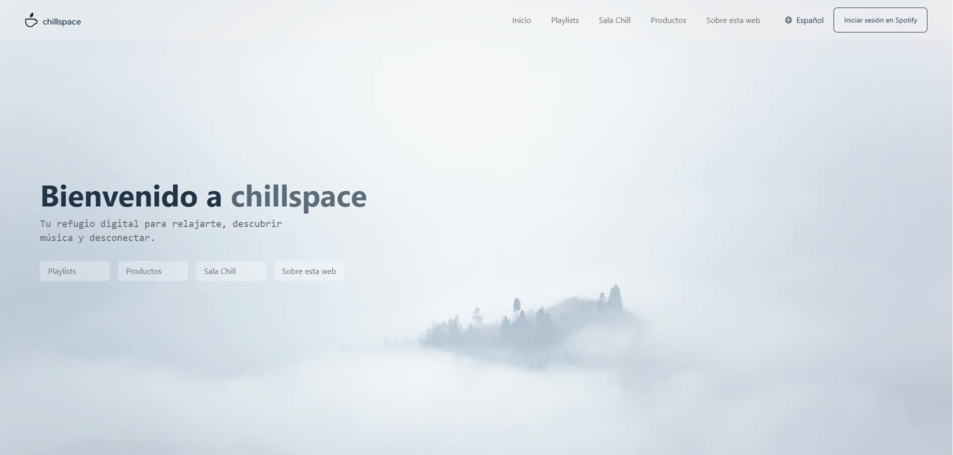
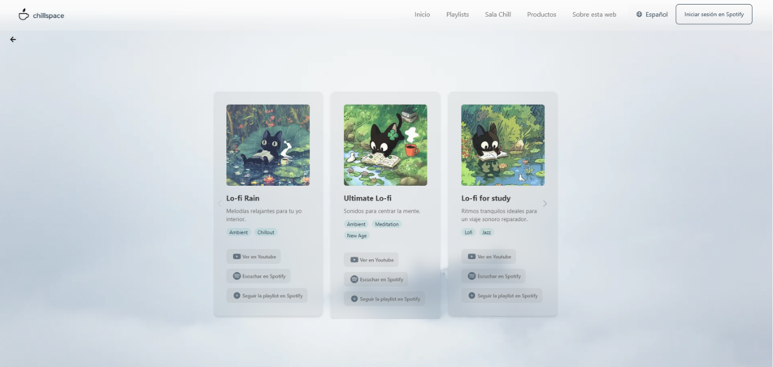
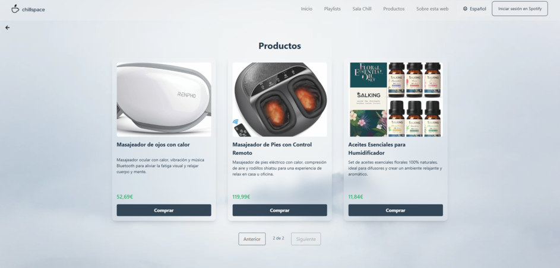

<!-- [](https://vercel.com/new/clone?repository-url=https://vercel.com/joanmrtnzs-projects/chillspace)
[](https://github.com/joanmrtnz/chillspace/actions)  
[](LICENSE) -->

## 

Chillspace es una aplicación de descubrimiento musical basada en tu estado de ánimo, construida con Next.js y la API Web de Spotify. Selecciona cómo te sientes y Chillspace te ofrecerá listas de reproducción cuidadosamente elegidas, además de una tienda curada de productos para la relajación y animaciones relajantes.

---

## Contenidos

- [Demo en vivo](#demo-en-vivo)  
- [Capturas](#capturas)  
- [Funcionalidades](#funcionalidades)  
- [Stack Tecnológico](#stack-tecnológico)  
- [Resumen de Comandos / Scripts](#resumen-de-comandos--scripts)  
- [Inicio Rápido](#inicio-rápido)  
- [Estructura del Proyecto](#estructura-del-proyecto)  
- [Datos e Internacionalización](#datos-e-internacionalización)  
- [Integración con Spotify](#integración-con-spotify)  
- [Resumen de Componentes](#resumen-de-componentes)  
- [Contribuciones](#contribuciones)  
- [Licencia](#licencia)

---

## Demo en vivo

☕ https://chillspace.app/

---

## Sneak peek

  
*Página principal.*

  
*Carrusel con listas según el mood “Relaxed”.*

  
*Página con productos relajantes recomendados.*

---

## Funcionalidades

* **Selección de estado de ánimo** mediante iconos (feliz, relajado, triste, etc.).  
* **Carrusel de listas**: navega por playlists de Spotify según tu estado de ánimo, con imágenes, títulos y géneros.  
* **Seguir listas**: botón para añadir una playlist a tu biblioteca de Spotify.  
* **Enlaces externos**: abre las playlists en Spotify o YouTube.  
* **Recomendaciones de tienda**: explora y compra productos con temática de relajación.  
* **Internacionalización**: soporte en inglés, español y catalán gracias a `next-intl`.  
* **Diseño responsivo**: maquetación mobile-first con Tailwind/PostCSS.  
* **Autenticación**: flujo OAuth2 para iniciar sesión con Spotify.

---

## Stack Tecnológico

* **Next.js** 15 (estructura con carpeta `app/`)  
* **React** 19 + **TypeScript**  
* **next-intl** para i18n  
* **Headless UI** & **react-icons** para componentes accesibles  
* **Swiper** para el carrusel  
* **Spotify Web API** para obtener estados de ánimo y listas  
* Configuración lista para desplegar en **Vercel**

---

## Resumen de Comandos / Scripts

| Script            | Descripción                      |
|-------------------|----------------------------------|
| `npm run dev`     | Ejecutar en modo desarrollo      |
| `npm run build`   | Preparar build de producción     |
| `npm start`       | Iniciar servidor en producción   |

---

## Inicio Rápido

1. **Clona el repositorio**  
   ```bash
   git clone https://github.com/joanmrtnz/chillspace.git
   cd chillspace
   ````

2. **Instala dependencias**

   ```bash
   npm install
   # o yarn
   ```
3. **Configura variables de entorno**
   Crea un archivo `.env` en la raíz con tus credenciales de Spotify:

   ```ini
   NEXT_PUBLIC_SPOTIFY_CLIENT_ID=tu_cliente_id_spotify
   NEXT_PUBLIC_SPOTIFY_CLIENT_SECRET=tu_cliente_secreto_spotify
   NEXT_PUBLIC_SPOTIFY_REDIRECT_URI=http://localhost:3000/api/callback
   NEXTAUTH_SECRET=una_cadena_segura_aleatoria
   ```
4. **Ejecuta en desarrollo**

   ```bash
   npm run dev
   # → http://localhost:3000
   ```
5. **Construye para producción**

   ```bash
   npm run build
   npm start
   ```

---

## Entorno y Despliegue

* **Vercel**: despliegues automáticos desde GitHub.
* **Variables de entorno**: configúralas en el dashboard de Vercel o en tu propio hosting.
* **Assets de imágenes**: bajo `/public/images` y `/public/icons`.

---

## Estructura del Proyecto

#### 1. Vista de alto nivel

```bash
.
├── public/               ← assets estáticos (logos, iconos e imágenes)
├── messages/             ← traducciones i18n (ca.json, en.json, es.json)
├── src/                  ← código fuente de la aplicación
├── next.config.ts        ← configuración de Next.js
├── postcss.config.mjs    ← configuración de Tailwind/PostCSS
├── package.json          ← dependencias y scripts
├── README.md             ← esta documentación
└── tsconfig.json         ← configuración de TypeScript
```

#### 2. Detalle de `src/`

```bash
src/
├── actions/
│   └── set-locale.ts            ← handler para cambiar idioma
├── app/
│   ├── layout.tsx               ← Layout global (Header, Footer, proveedor i18n…)
│   ├── globals.css              ← Estilos globales
│   ├── page.tsx                 ← `/` (home: selección de moods)
│   ├── about/
│   │   └── page.tsx             ← `/about`
│   ├── spotify-login/
│   │   └── page.tsx             ← `/spotify-login`
│   ├── chillroom/
│   │   └── page.tsx             ← `/chillroom`
│   ├── playlists/
│   │   ├── page.tsx             ← `/playlists` (selector de mood)
│   │   ├── loading.tsx          ← UI de carga para playlists
│   │   └── [mood]/
│   │       ├── PlaylistsClient.tsx← cliente React para fetch
│   │       └── page.tsx         ← `/playlists/[mood]`
│   └── products/
│       ├── ProductCard.tsx      ← tarjeta de producto
│       └── page.tsx             ← `/products`
├── components/
│   ├── Header.tsx
│   ├── Footer.tsx
│   ├── LanguageSelect.tsx
│   ├── PlaylistCarousel.tsx
│   ├── PlaylistCard.tsx
│   ├── FollowPlaylistButton.tsx
│   ├── BackButton.tsx
│   └── ResultDialog.tsx
├── data/
│   ├── moods.json               ← definición de moods y playlists
│   └── products.json            ← lista de productos para la tienda
├── i18n/
│   └── request.ts               ← cargador de locale para next-intl
└── lib/
    ├── spotify/
    │   ├── auth.ts              ← helpers OAuth de Spotify
    │   ├── moods.ts             ← lectura de moods.json
    │   └── playlists.ts         ← llamadas a Spotify Web API
    └── products/
        └── products.ts          ← lectura de products.json
```

---

## Datos e Internacionalización

* **`src/data/moods.json`**
  Define cada estado de ánimo (id, icono, nombre, array de playlists).
* **`src/data/products.json`**
  Lista de productos de tienda (ruta de imagen, enlace de Amazon, precio).
* **`messages/[lang].json`**
  Traducciones de UI para inglés (`en.json`), español (`es.json`) y catalán (`ca.json`).

---

## Integración con Spotify

1. **Autenticación OAuth** (`src/lib/spotify/auth.ts`)

   * Genera la URL de autorización para Spotify.
   * Procesa el callback, intercambia el código por un token de acceso y lo almacena.

2. **Gestión de metadatos de estados de ánimo** (`src/lib/spotify/moods.ts`)

   * Lee `moods.json` para obtener los IDs de playlists y sus metadatos.

3. **Lógica de seguimiento de playlists**

   * **Cliente UI** (`components/FollowPlaylistButton.tsx`):
     Envía la petición al endpoint interno `/api/follow-playlist`.
   * **Ruta API** (`src/app/api/follow-playlist/route.ts`):
     Recibe `playlistId` y token de usuario. Llama a `followPlaylistFlow(playlistId, token)`.
   * **Función de negocio** (`src/lib/spotify/playlists.ts`):
     Implementa `followPlaylistFlow(playlistId, token)` que realiza la llamada a Spotify para “seguir” la playlist.

---

## Resumen de Componentes

* **`Header` / `Footer`**: navegación y selector de idioma.
* **`LanguageSelect`**: dropdown para cambiar locales.
* **`PlaylistCarousel`**: slider con Swiper y tarjetas de playlists.
* **`PlaylistCard`**: muestra imagen, título, géneros y botones.
* **`ResultDialog`**: modal para confirmar seguimiento o mostrar errores.

---

## Contribuciones

1. Haz fork del repositorio.
2. Crea una rama para tu feature.
3. Abre un Pull Request — incluye tests para nuevas funcionalidades.

---

## Licencia

MIT © [joanmrtnz](https://github.com/joanmrtnz)
